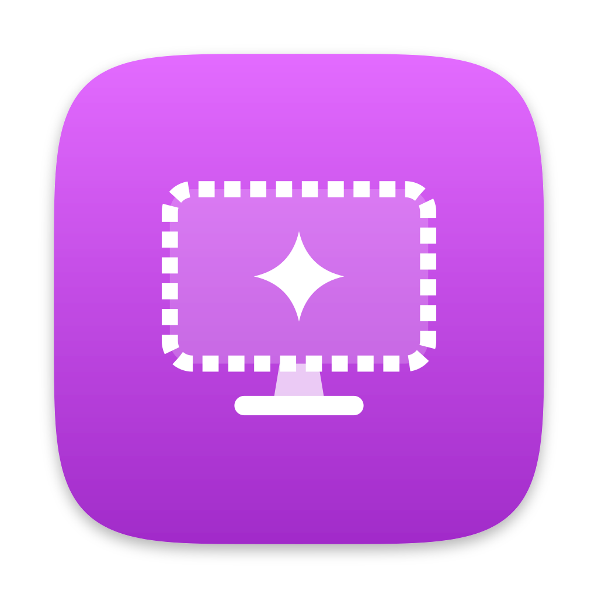

# figment

Virtual displays for your Mac, of any size, including 4K and HiDPI.

Handy on a Mac with no monitor, or to give agents and screen sharing a
bigger desktop than the one you have. Built on macOS's private
CGVirtualDisplay API.

Single Objective-C file, no dependencies.

## Build & install

```sh
./install.sh   # builds, installs figment to ~/.local/bin
```

`FIGMENT_INSTALL_DIR=...` overrides the destination. Or `make`, and
`make install` (to `/usr/local/bin`, `PREFIX=...` to override).

## Usage

```sh
figment start 4k                  # 3840x2160, looks like 1920x1080
figment start 2560x1600           # any even size
figment list
figment scale 12                  # the sizes display 12 can look like
figment scale 12 2560x1440        # switch to one
figment stop 12                   # by display ID
figment stop                      # all of them
```

`start` prints the new display's ID and returns once the display is
online. Sizes are in pixels, even, from 720 a side up to 8K's pixel
count. The 16:9 presets are `720p`, `1080p`, `1440p`, `4k`, `5k` and
`8k`.

Like on real monitors, displays 2880 pixels wide and up are HiDPI: they
render at 2x and look like half their size, so a 4K display has the
space of a 1080p one, with sharp text. `--hidpi` and `--no-hidpi`
override that. HiDPI sizes round down to a multiple of 4.

A HiDPI display also offers the Larger Text to More Space sizes of a
Retina panel, in Displays settings or through `figment scale`. Like on a
real Mac, More Space renders at 2x too, so a 4K display that looks like
2560x1440 is 5120x2880 pixels, and so are its screenshots.

Each display is held by a background figment process and comes back
after logging out or restarting, at the same size and number, until
`figment stop`. That uses a LaunchAgent per display, in
`~/Library/LaunchAgents/dev.figment.<N>.plist`. Ending the process some
other way removes the display until the next login. `figment stop`
wakes the screen, since while it sleeps macOS waits to remove displays.

To screenshot a display, `screencapture -D <n>` numbers displays from 1
in the order macOS lists them, which is not the display ID.

On a Mac with no monitor, macOS shows a 1920x1080 placeholder display.
The first figment display takes its place, and it comes back once the
last one stops.
